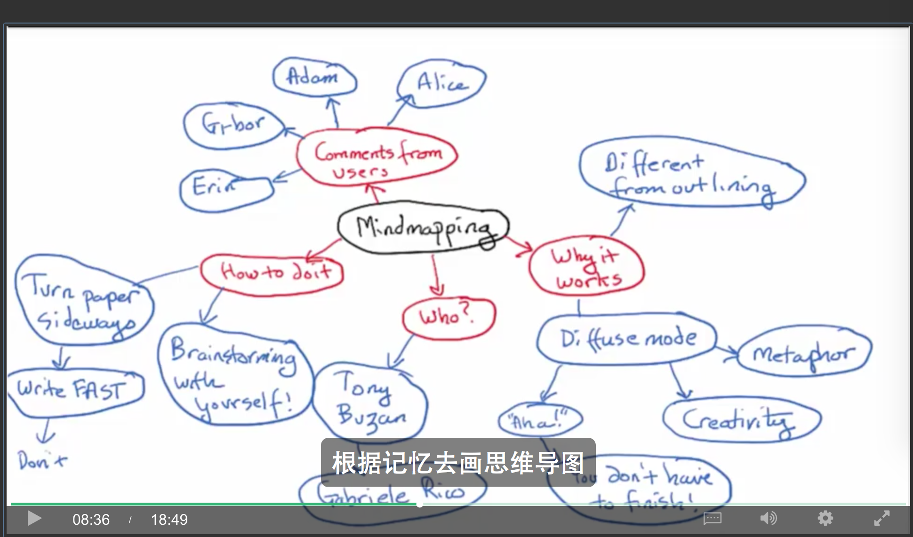

# Learning how to learn筆記：心智圖

以前我只有聽過心智圖(**MindMapping**，中國通常翻譯「思維導圖」)，沒有實際操作過，後來觀看learning how to learn的課程時才是真正第一次接觸mindmapping。

> 出處：[Optional Interview with Writing Coach Daphne Gray-Grant](https://www.coursera.org/learn/learning-how-to-learn/lecture/01m6e/optional-interview-with-writing-coach-daphne-gray-grant)

看完這影片，讓我很震撼，也讓我想起我以前[大學時的讀書方法](./大學時我讀書的方法.md)

# Daphne Gray-Grant的教導

以下內容摘錄自[Optional Interview with Writing Coach Daphne Gray-Grant](https://www.coursera.org/learn/learning-how-to-learn/lecture/01m6e/optional-interview-with-writing-coach-daphne-gray-grant)

## mindmapping與大腦的「發散模式」

>你需要的是活躍、清醒的**發散思維**來駕馭**寫作時的大腦**，所以我喜歡用mindmapping來幫助人們運用大腦的**發散模式**。

>我尤其鼓勵學生寫作前不要列提綱，我知道這違背了你在10年級時英語老師給你的寫作建議。但是你想想實際上，寫提綱用的是專注大腦，專注大腦擅於拼寫語法以及字母順序，這都是些非常特定的任務。

>但是寫作時你要的是**創造**、你要的是**思考**事物、你要的是去創造**新的聯想**，這時你真正需要的是大腦進入發散模式。

>在做mindmapping的時候要把紙張橫放，將主題寫在紙的中央，然後在上面畫個圈

>畫好圈之後圍繞著它，**腦子裡想到什麼就寫什麼**

>我想打個比方大家可能會覺得有點粗俗，但我還是要說。它有點像在紙上嘔吐。所以不要瞻前顧後，**別去質疑出現在你腦海中的任何點子，寫下來就好**。

## mindmapping實例

>好些年前我畫過一個mindmapping，從那以後我一直用它做例子教大家怎麼畫。

>我的mindmapping是關於開學第一天的，所以我在紙中央寫的是“開學第一天”  

>我選擇這個主題的部分原因是，可以輕而易舉地將它分成明顯的幾類，比如說小學、高中、大學。

>開學第一天也會因這些事件而有所不同，所以我把它們寫下來，然後在上面畫上小小的橫線。我畫它們是因為，當你看mindmapping時能一眼就看到主題，繼續看下去你會發現我在“一年級”這個圈的右上角，寫下了“蜜蜂叮咬”。

>蜜蜂叮咬和我小學一年級的第一天有什麼關係呢？

>好吧在我一年級開學的第一天，我和媽媽一起站在校園裡的時候我的嘴唇被蜜蜂蟄了，我永遠都不會忘記那一瞬間，對我來說“開學第一天”打上了“被蜜蜂蟄”的烙印，那隻蜜蜂就在我嘴唇上，所以我需要寫的就是兩個單詞蜜蜂、叮咬 這樣所有的事情都回憶起來了。

>腦海中浮現出被蟄的地點真真切切就是當時站在操場的那個位置，我還記得那個壞脾氣的老修女朝我走來，問我出什麼大事了為什麼我在哭，你懂的，就好像是，

>**我僅僅依賴這兩個單詞就已經在自己的腦子裡放了場電影**

## 學習時如何mindmapping

>大家可以這樣使用mindmapping當你採訪某人時，你會做筆記然後你可以將筆記放在一邊，根據記憶去畫mindmapping，我保證你的大腦記住的都是那些最有趣的事情。

>然而對於大學生來說這個問題就有點不同了，因為你去採訪一群人的機率不大，還不如說你要去“採訪”的是一堆書本。

>原理是相同的，如果真的有你很感興趣很重要的內容，而且是你研究所必須的你就會很容易記住它們，其中最重要的東西會浮現在你記憶的頂部，你會記住它們然後就可以做相關的mindmapping了

# 用xmind實戰mindmapping

工程師如何實戰mindmapping，請參閱[xmind使用技巧](./xmind使用技巧.md)
