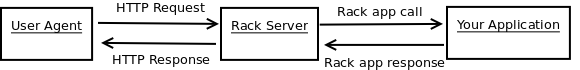
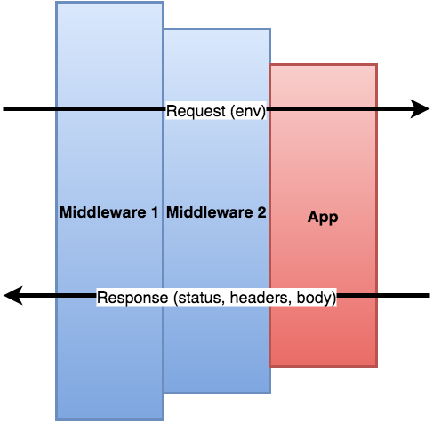

# 深入淺出 rack

rack是一個協定(protocol)，是一個接口(interface)，來傳遞 HTTP request/response。透過rack能夠連結到我們的Ruby web app。




# 一個簡單的rack app

現在我們先來寫個簡單的rack app，如果你的還沒裝rack，可以下指令`gem install rack`來安裝。

```Ruby
# first_rack_app.rb

require "rack"

class FirstRackApp
  def call(env)
    status = 200
    headers = {"Content-Type" => "text/html"}
    body = ["This is my first web app"]

    return [status, headers, body]
  end
end

Rack::Handler::WEBrick.run(FirstRackApp.new, Port:3001)
```

執行`ruby first_rack_app.rb`後，去`http://localhost:3001/`就能看到 "This is my first web app" 這行字了，若想要讓它中斷下指令`ctrl c`即可。

>由於Ruby可以省略`return`以及`()`的特性，所以這段code可以更簡潔寫成

```Ruby
# first_rack_app.rb

require "rack"

class FirstRackApp
  def call(env)
    status = 200
    headers = {"Content-Type" => "text/html"}
    body = ["This is my first web app"]

    [status, headers, body]
  end
end

Rack::Handler::WEBrick.run FirstRackApp.new, Port:3001
```

這段code很簡單，我寫了一個rack app，裡面定義了一個`call` method，它回傳一個 array 。依序是

1. Status Code：200
2. Header：**一個hash**，我請求的Content-Type是text，於是我可以在body寫一串text
3. Body：**一個array**，這array裡面有著一串string


>若是不懂Status code、Header是什麼，可以參考下面兩篇
>- [The Will Will Web | 網頁開發人員應了解的 HTTP 狀態碼](http://blog.miniasp.com/post/2009/01/16/Web-developer-should-know-about-HTTP-Status-Code.aspx)
>- [List of HTTP header fields - Wikipedia](https://en.wikipedia.org/wiki/List_of_HTTP_header_fields)

於是，你可以在一些rack文章上面看到更簡潔的寫法

```Ruby
# first_rack_app.rb

require "rack"

class FirstRackApp
  def call(env)
    [200, {"Content-Type" => "text/html"}, ["This is my first web app"]]
  end
end

Rack::Handler::WEBrick.run FirstRackApp.new, Port:3001
```

>rack app的結構很簡單：
>
>- 一個`call` method
>- 回傳一個array
>   - HTTP status
>   - header
>   - body

# env是什麼？

我們來改一下code，看看這個`env`是什麼吧

```Ruby
# first_rack_app.rb

require "rack"

class FirstRackApp
  def call(env)
    [200, {}, [env.inspect]]
  end
end

Rack::Handler::WEBrick.run FirstRackApp.new, Port:3001
```

接著，我們在Terminal下開一個分頁，然後到`first_rack_app.rb`所在的路徑位置，下指令`curl http://localhost:3001/`，於是我們看到了**一大串hash**。

```
$ curl http://localhost:3001/
{
  "GATEWAY_INTERFACE"=>"CGI/1.1",
  "PATH_INFO"=>"/",
  "QUERY_STRING"=>"",
  "REMOTE_ADDR"=>"::1",
  "REMOTE_HOST"=>"::1",
  "REQUEST_METHOD"=>"GET",
  "REQUEST_URI"=>"http://localhost:3001/",
  "SCRIPT_NAME"=>"",
  "SERVER_NAME"=>"localhost",
  "SERVER_PORT"=>"3001",
  "SERVER_PROTOCOL"=>"HTTP/1.1",
  "SERVER_SOFTWARE"=>"WEBrick/1.3.1(Ruby/2.4.0/2016-12-24)",
  "HTTP_HOST"=>"localhost:3001",
  "HTTP_USER_AGENT"=>"curl/7.43.0",
  "HTTP_ACCEPT"=>"*/*",
  "rack.version"=>[1, 3],
  "rack.input"=>#<StringIO:0x007fd4a894fde8>,
  "rack.errors"=>#<IO:<STDERR>>,
  "rack.multithread"=>true,
  "rack.multiprocess"=>false,
  "rack.run_once"=>false,
  "rack.url_scheme"=>"http",
  "rack.hijack?"=>true, "rack.hijack"=>#<Proc:0x007fd4a894fb18@/Users/nicholas/.rvm/gems/ruby-2.4.0/gems/rack-2.0.1/lib/rack/handler/webrick.rb:74 (lambda)>,
  "rack.hijack_io"=>nil,
  "HTTP_VERSION"=>"HTTP/1.1",
  "REQUEST_PATH"=>"/"}
```

**`env`也就是environment是一個hash**。`env`被傳到`call` method裡去，於是Rack environment知道了這個request的很多資訊。我們可以看到，這個request是送出一個`GET`請求(`"REQUEST_METHOD"=>"GET"`)。，也可以看到我們在code裡定義的port 3001(`"SERVER_PORT"=>"3001"`)，欲了解這些Rack environment的定義可以看[Rack doc](http://www.rubydoc.info/github/rack/rack/master/file/SPEC#The_Environment)。

# 為何rack app要定義`call` method

上面的範例，我們的rack app裡面，只有定義一個`call` method，為何rack要定義這個`call` method呢？

在其他Rack的文章你可能會常看到，rack app接一個proc或lambda，像是：

```Ruby
app = proc do |env|
  ['200', {'Content-Type' => 'text/html'}, ['Hello, Rack!']]
end
```

或

```Ruby
application = lambda do |env|
  [200, { "Content-Type" => "text/html" }, ["Yay, your first web application! <3"]]
end
```

這就是Rack會定義`call` method的主要原因。

當我們的Ruby web app 被Rack app呼叫(`call`)時，Rack app 的實體(instance)其實是一個proc或lambda instance，然後它調用了proc與lambda的default method，也就是`call`。不得不說Rack的作者真的很聰明，想到這寫法。

>如果對proc或lambda不熟，可以參考我寫的[block、proc、yield、lambda之間的關係](https://github.com/NickWarm/Articles/wiki/block、proc、yield、lambda之間的關係)

# 更細膩地操作`call`：語意化method與path

Rack app裡頭只有一個`call` method，`env`是一大串hash，當我們需要hash裏頭的一些特定資訊時，我的`call` method要怎麼寫呢？

在此，以`env`中的`"REQUEST_METHOD"`與`"PATH_INFO"`為例，我現在定義一個Rack app

```Ruby
# some_rack_app.rb

class SomeRackApp
  def call
    handle_request(env['REQUEST_METHOD'], env['PATH_INFO'])
  end

  private
  def handle_request(method path)
    if method == "GET"
      get(path)
    else
      method_not_allowed(method)
    end
  end

  def get(path)
    [200, {"Content-Type" => "text/html"}, ["You have requested the path #{path}, using GET"]]
  end

  def method_not_allowed(method)
    [405, {}, ["Method not allowed: #{method}"]]
  end
end
```

這段code很簡單，當rack app調用`call`時，會把`env` hash得到的`REQUEST_METHOD`與`PATH_INFO`傳進我們自己定義的`handle_request` method裡面。接著用一個`if..else`做判斷，如果`REQUEST_METHOD`是GET，就調用自定義的`get` method來回傳一組array，如果`REQUEST_METHOD`不是GET，就用自定義的`method_not_allowed`，回傳另一組array

如果我們把所有的邏輯都寫在`call`裡頭，時間久了後再去讀code就很難讀，**但我們把它語意化包成一個個method，就會非常直覺了**。

>`private`在Ruby裡面是一個method，在Ruby的`private` method其實不只Class自己內部可以存取，它的SubClass也可以存取。
>
>如果對private的意義不熟，可以參考這篇文章
>- [Public, Protected and Private Method in Ruby - 高見龍](http://kaochenlong.com/2011/07/26/public-protected-and-private-method-in-ruby/)

# Rack::Handler

回到最前面最簡單的rack app，`first_rack_app.rb`最結尾有一行`Rack::Handler::WEBrick.run FirstRackApp.new, Port:3001`，這個`Rack::Handler`是什麼？`WEBrick`是什麼？

Rack用handler來跑(`run`) Rack app，在此我們選的是`WEBrick`這個handler。

我們可以在env hash中看到`"SERVER_SOFTWARE"=>"WEBrick/1.3.1(Ruby/2.4.0/2016-12-24)"`。

WEBrick是ruby內建的HTTP server，其他還有些常見的還有：Puma、Unicorn, Thin, Apache via Passenger...。

假如我們要用Puma的話，就寫

```
require "rack/handler/puma"

...

Rack::Handler::Puma.run FirstRackApp.new, Port:3001
```

#  `Rack::Builder`與`config.ru`

原本要啟動rack app，必須寫一個Ruby檔，然後`require "rack"`，啟動時也要寫一大串`Rack::Handler::WEBrick.run`。

若想要用更簡潔地寫法啟動rack app，則我們可以透過`Rack::Builder`。首先新增一個`config.ru`

```Ruby
# config.ru

class FirstRackApp
  def call(env)
    [200, {"Content-Type" => "text/html"}, ["This is my first web app"]]
  end
end

run FirstRackApp.new
```

然後在`config.ru`所在的位置，下指令`rackup -p 3001`，接著去瀏覽器`http://localhost:3001/`就能看到 "This is my first web app"

>`config.ru`中的`ru`就是指`rackup`，所以才會在Rebuilding rails上看到用`rackup -p 3001`這指令來啟動我們的Ruby web app。
>
>`Rack::Builder` is a pattern that allows us to more succinctly define our application and the middleware stack surrounding it.
>
>ref
>- [What is Rack? | Ruby on Rails Tutorial by thoughtbot](https://thoughtbot.com/upcase/videos/rack)
>
>推薦這篇文章`Rack::Builder`這節，說明了不用`config.ru`是怎麼寫`Rack::Builder`
>- [Advanced Rack — Gabe Berke-Williams](http://gabebw.com/blog/2015/08/10/advanced-rack)
>
>in `config.ru`, `use` adds middleware to the stack, `run` dispatches to an application. You can use `map` to construct a Rack::URLMap in a convenient way.
>
>ref
>- [Class: Rack::Builder — Documentation for rack/rack (master)](http://www.rubydoc.info/github/rack/rack/Rack/Builder)


這樣寫，並不只是為了更簡潔，而是要帶入middleware的概念

# Middleware的概念

Middleware本身就是一個rack app。

在`config.ru`裡可以用`use`調用先前編寫的一支支Middlewares，例如：

```Ruby
# config.ru

require './app.rb'
require './middleware1.rb'
require './middleware2.rb'
require './middleware3.rb'

use Middleware1
use Middleware2
use Middleware3

run App.new
```

如上面的code所示，Rack::Builder依序使用了三個middleware，最後才執行App。用這樣的方式產生出一個Rack app

這段code的效果等同如下

```
rack_app = Middleware1.new(Middleware2.new(Middleware3.new(App)))
```

文章開頭時，我們看到下面這張圖，幫助我們理解rack與user以及我們的Ruby web app的關係。


我們可以看到user送出的request先通過rack server然後才送到Ruby web app。

也就是說，user送出的request先經過rack app的處理後，才送進我們的ruby web app，透過下面這張圖，能直觀地了解rack app做了什麼事



一層又一層的Middleware攔截了我們的request並對他做處理與修改，如此一來Ruby web app所收到的request，就只會有這app所需要的資訊，而不會有其他多餘的資訊。

>這樣的模式稱之為pipeline design pattern，推薦閱讀下面兩篇，尤其是維基百科的那張圖，看了會很有感覺
>- [指令管線化(Instruction pipeline) - 維基百科](https://zh.wikipedia.org/wiki/指令管線化)
>- [comment: ruby on rails - What is Rack middleware? - Stack Overflow](http://stackoverflow.com/a/2257031)
>
>Rack middleware is more than "a way to filter a request and response" - it's an implementation of the pipeline design pattern for web servers using Rack.
>
>It very cleanly separates out the different stages of processing a request - separation of concerns being a key goal of all well designed software products.


# Middleware與`config.ru`

在`config.ru`裡，可以用`run`、`map`、`use`這三個method
- `run`：執行一個proc或lambda的instance
- `use`：告訴我們的Rack app要使用什麼middleware
- `map`：告訴Rack app什麼路徑(`path`)，要用什麼middleware與rack app來處理

在這邊給一個`map`很具體的例子

```Ruby
# config.ru

require './main_rack_app.rb'
require './admin_rack_app.rb'
require './first_middleware.rb'
require './second_middleware.rb'

map '/' do
  use FirstMiddleware
  run MainRackApp.new
end

map '/admin' do
  use SecondMiddleware
  run AdminRackApp.new
end
```

當送過來的requets，它的`"REQUEST_PATH"=>"/"`就給`FirstMiddleware`與`MainRackApp`處理。

當送過來的requets，它的`"REQUEST_PATH"=>"/admin"`就給`SecondMiddleware`與`AdminRackApp`處理。

如此一來，我們就能依照不同路由，來給我們的request通過不同的middleware與rack app進行處理。

rack也有提供不少[包好的middleware](https://github.com/rack/rack/wiki/List-of-Middleware)讓人使用


# Middleware的具體細節

這邊就直接給一個簡單的例子，延續先前的`config.ru`範例

原本我們知道的`config.ru`大概會這樣寫

```Ruby
# 原始config.ru

class MyApp
  def call(env)
    [200, {"Content-Type" => "text/html"}, ["This is my app"]]
  end
end

run FirstRackApp.new
```

現在我把rack app的部分獨立成`my_app.rb`

```Ruby
# my_app.rb

class MyApp
  def call(env)
    [200, {"Content-Type" => "text/html"}, ["This is my app."]]
  end
end
```

這個時候，`config.ru`應該改寫成

```Ruby
# config.ru

require "./my_app.rb"

app = MyApp.new

run app
```

接著我寫一個簡單的middleware，`my_app_middleware.rb`

Middleware會用class包起來，先定義`initialize` method，再定義`call` method。

```Ruby
# my_app_middleware.rb

class MyAppMiddleware
  def initialize(app)
    @app = app
  end

  def call(env)
    code, headers, body = @app.call(env)
    message = "This is my app middleware."
    body << message

    [code, headers, body]
  end
end
```

如上面code所示，我先透過`initialize` method去撈出rack app，接著再定義`call` method。

在middleware的`call` method裡，一開始先用`@app.call`去撈出我原本在`my_app.rb`裡定義call食撈出的array，然後存成`code`、`headers`、`body`

接著我塞一串字串進到body裡去，最後再回傳一個array。

我回到`config.ru`來使用我剛剛寫好的middleware

```Ruby
require "./my_app.rb"
require "./my_app_middleware.rb"

app = MyApp.new

use MyAppMiddleware

run app
```

然後一樣下指令`rackup -p 3001`，接著你就能在`http://localhost:3001/`看到 " This is my app.This is my app middleware. "

再來個`map`的具體實例吧。

現在我創造另一個middleware `hello_nick_middleware.rb`

```Ruby
# hello_nick_middleware.rb

class HelloNickMiddleware
  def initialize(app)
    @app = app
  end

  def call(env)
    code, headers, body = @app.call(env)
    body <<  "Hello, Nick"
    [code, headers, body]
  end
end
```

然後再修改一下`config.ru`

```Ruby
# config.ru

require "./my_app.rb"
require "./my_app_middleware.rb"
require "./hello_nick_middleware.rb"
require "./sao.rb"

app = MyApp.new
sao = SAO.new

map '/' do
  use MyAppMiddleware
  run app
end

map '/nick' do
  use HelloNickMiddleware
  run sao
end
```

`rackup`之後，你可以去`http://localhost:3001/nick`看到我們第二個middleware所插入進去的字串


另外要注意一下，`config.ru`的top-level context只能有一個`run`，像是

```Ruby
# config.ru

... #上面略

map '/admin' do
  use MyAppMiddleware
  run app
end

map '/nick' do
  use HelloNickMiddleware
  run sao
end

run myapp
```

>top-level所`run`的rack app，會預設是`/`路徑的request，依此邏輯在top level裡`run`兩個不同的rack app就沒有意義了。
>
>若不清楚什麼是top level可以參考下面兩篇文章
>- [ruby的top-level](https://sibevin.github.io/posts/2016-10-02-124209-ruby-top-level)
>- [What is the Ruby Top-Level? | Like Dream of Banister Fiend](https://banisterfiend.wordpress.com/2010/11/23/what-is-the-ruby-top-level/)

# 一些常用的東西

在前面的「更細膩地操作`call`：語意化method與path」這節，曾看到用`env["REQUEST_METHOD"]`來查看用什麼request method，rack提供更便利的方式來操作`env`這hash裡的 key-value pairs。

```
request = Rack::Request.new(env)
```

`Rack::Request`提供了一些method讓我們不用直接操作`env`的hash

```
# 等同於 env["REQUEST_METHOD"]
request.request_method

# 等同於 env["rack.request.query_hash"] + env["rack.input"]
request.params

# 等同於 env["REQUEST_METHOD"] == "GET"
request.get?
```

最後簡單兩個範例常見的`Rack:Request`與`Rack:Response`

## Rack:Request的例子

建一個`my_app1.rb`

```Ruby
require 'rack'

class MyApp1
  def call(env)
    # 创建一个request对象，就能享受Rack::Request的便捷操作了
    @request = Rack::Request.new env
    method = @request.request_method
    info = @request.path_info

    puts "This website request method is `#{method}` "
    puts "This website path info is `#{info}`"

    [200, {}, ['hello world']]
  end
end

Rack::Handler::WEBrick.run MyApp1.new, Port:3001
```

執行`ruby my_app1.rb`然後去`http://localhost:3001/`，接著你可以在Terminal看到

```
$ ruby my_app1.rb
[2017-03-13 16:14:58] INFO  WEBrick 1.3.1
[2017-03-13 16:14:58] INFO  ruby 2.2.2 (2015-04-13) [x86_64-darwin14]
[2017-03-13 16:14:58] INFO  WEBrick::HTTPServer#start: pid=61940 port=3001
This website request method is `GET`
This website path info is `/`
localhost - - [13/Mar/2017:16:15:01 CST] "GET / HTTP/1.1" 200 11
- -> /
This website request method is `GET`
This website path info is `/favicon.ico`
```

我們確實可以看到這個request用的method與path information

```
This website request method is `GET`
This website path info is `/`
```

>PS：會看到`/favicon.ico`是因為瀏覽器會去抓網站的logo，可以參考下面兩篇
>- [The Will Will Web | 介紹 Favicon.ico 重點觀念](http://blog.miniasp.com/post/2007/12/17/Introduce-faviconico-and-important-concept.aspx)
>- [[架站] 為什麼網站的根目錄最好有 favicon.ico 和 robots.txt 存在？ | jjdai Blog](http://jjdai.zhupiter.com/2011/10/架站-為什麼網站的根目錄最好有-favicon-ico-和robots-txt-存在/)

## Rack::Response的例子

建一個`my_app2.rb`

```Ruby
require 'rack'

class MyApp2
  def call(env)
    # 创建一个request对象，就能享受Rack::Request的便捷操作了
    @response = Rack::Response.new env
    @response.set_cookie('token', 'xxxxxxx123')
    @response.headers['Content-Type'] = 'text/plain'

    puts @response.inspect
    [200, {}, ['hello world']]
  end
end

Rack::Handler::WEBrick.run MyApp2.new, Port:3001
```

執行`ruby my_app2.rb`然後去`http://localhost:3001/`，接著你可以在Terminal看到很長一大串

```
$ ruby my_app2.rb
[2017-03-13 16:33:03] INFO  WEBrick 1.3.1
[2017-03-13 16:33:03] INFO  ruby 2.2.2 (2015-04-13) [x86_64-darwin14]
[2017-03-13 16:33:03] INFO  WEBrick::HTTPServer#start: pid=62319 port=3001
#<Rack::Response:0x007f957b99b520 @status=200, @header={"Content-Length"=>"7805", "Set-Cookie"=>"token=xxxxxxx123", "Content-Type"=>"text/plain"}, @writer=#<Proc:0x007f957b99aad0@/Users/nicholas/.rvm/gems/ruby-2.4.0/gems/rack-2.0.1/lib/rack/response.rb:32 (lambda)>,......

(後面省略)
```

不過你可以看到，我們在程式裡寫的cookie與header都成功寫到response裡去了

更多method可以參考Rack doc
- [Class: Rack::Request — Documentation for rack (2.0.1)](http://www.rubydoc.info/gems/rack/Rack/Request)
- [Class: Rack::Response — Documentation for rack/rack (master)](http://www.rubydoc.info/github/rack/rack/Rack/Response)

ref
- [Advanced Rack — Gabe Berke-Williams](http://gabebw.com/blog/2015/08/10/advanced-rack)
- [What is Rack? | Ruby on Rails Tutorial by thoughtbot](https://thoughtbot.com/upcase/videos/rack)
- [Your first Rack app | Webapps for Beginners](http://webapps-for-beginners.rubymonstas.org/rack/hello_world.html)
- [The Rack Env | Webapps for Beginners](http://webapps-for-beginners.rubymonstas.org/rack/rack_env.html)
- [Method and Path | Webapps for Beginners](http://webapps-for-beginners.rubymonstas.org/rack/method_path.html)
- [Web Development in Ruby : Environment Variables in Rack App](https://rubyplus.com/articles/2091-Web-Development-in-Ruby-Environment-Variables-in-Rack-App)
- [Ruby Rack及其应用（上）](http://huiming.io/2016/11/10/ruby-rack.html)
- [Ruby进阶之Rack入门 - 简书](http://www.jianshu.com/p/e748422e3692)
- [Ruby进阶之Rack深入 - 简书](http://www.jianshu.com/p/d74fa30b849f)
- [JoelQ/intro-rack-notes: Intro to Rack](https://github.com/JoelQ/intro-rack-notes)
- [Understanding Rack Apps and Middleware](https://blog.engineyard.com/2015/understanding-rack-apps-and-middleware)
