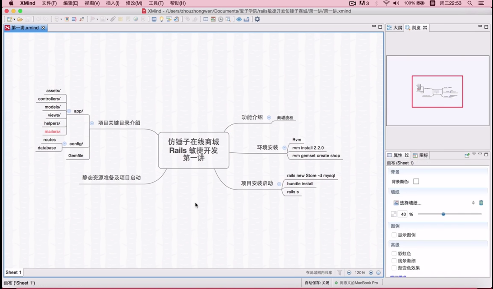

# xmind使用技巧

Google搜尋xmind就能在他的官網找到[載點](http://actsmind.com/blog/software/xmind3download)

開始這篇之前，建議看過[Learning how to learn筆記：心智圖](./Learning how to learn：心智圖.md)

## 範例

這是我[第一次使用xmind的專案](https://github.com/NickWarm/AJAXonRails/tree/master/ex1_kakas)。我是依據臨摹這專案時[所做的筆記](https://github.com/NickWarm/AJAXonRails/tree/master/ex1_kakas/wiki)來mindmapping

# 我自己實戰後的經驗

用xmind實際mindmapping後，它給我一種很奇妙的感覺。

我一邊mindmapping一邊回憶我寫過的code，散落在不同檔案的程式碼，它們之間互相有關聯。

第一次臨摹時，我很難搞懂程式碼之間的關聯，等到我mindmapping時，用不同的線條做連結，整個思路就清晰完整了

# 操作細節

我個人習慣選擇**邏輯圖(向右)**

畫面的放大：`cmd +`、縮小：`cmd -`

>對於快捷鍵，通常我習慣用`+`來表達要按的組合鍵，但是因為放大縮小分別是`cmd`再加個`+`與`-`，若是加個`+`在兩個鍵中間實在有點怪，所這組快捷鍵沒加，其他組合鍵之間都會加`+`

### 主要主題

點選**中心主題**

然後按`enter`

就會生成**主要主題**

### 生成同階層的主題

點選該階層的主題

然後按`enter`

就會生成**同階層的主題**

### 生成下一階層的子主題

點選**主要主題**

然後按下`cmd + enter`

`cmd + enter`按越多次生成越多階層子主題

### Toolbar的使用

xmind軟體最上排有Toolbar，只要把滑鼠游標移過去停在那邊，就能看到快捷鍵如何使用

我較常用的是
- 關連線：`cmd + l`
- 括弧總號：`cmd + ]`

剩下更多功能，就待你自己發掘了

# 為何推薦使用xmind

在澎湖服役時，對於程式的學習，我大部份都還是用手寫筆記本來mindmapping，但那效率非常之差，直到有天我在youtube看[教寫購物車的影片](https://www.youtube.com/watch?v=xlKtLEL21R4&list=PLO5e_-yXpYLCW5QmXUKVt88HI898fHfiF)發現一個我以前完全沒看過的程式**xmind**

不知為何xmind的中文資料不多，我是臨摹完上面那一個AJAX範例時，想到我用Atom都是使用快捷鍵的，那xmind應該也有快捷鍵，於是手癢try & error，測試xmind有哪些快捷鍵，越玩越順手能快速mindmapping，於是開始使用它。

# 學習使用xmind來mindmapping的好處

以下引用自[千古刘传 - 少数人才能掌握决胜未来的两大能力](http://www.jianshu.com/p/d9da4237db7a)

> 精神病學家Gary Small用fMRI掃描老人的大腦，發現經常使用互聯網搜索的老人，其大腦幾個主要區域的活性比非互聯網用戶的老人高出兩倍，資深網民的決策控制、複雜推理、直覺洞察等行為有顯著增強，包括大腦的額極、海馬狀突起區域皆有體現。

> **一樣新技術或新技能的習得，使得生命體的大腦得到了全新的訓練和增強**。

> 理解這個結論是容易的，但很多人並沒有意識地套用到生活中。

> 例如我跟很多同事說，你一定要會學會用思維導圖軟件，無論是做規劃還是整理，效果更好。得到的回復是，我用word也行啊，幹嘛要學它。

> 又比如，我跟同事說，你一定要會用Evernote，做整理的效率更高，它有關鍵詞檢索功能，儲備了足夠的資料，就相當於你的外部腦。同事說，我覺得還是寫到筆記本上比較好。

> 每多掌握一項新技術，你的個人綜合能力就會大幅增長。當多種新技術共同作用時，這種能力增長就不會是線性的，而是指數型增長，這樣就會出現能力增長的**馬太效應**。

題外話：我最近在看[關於我轉生變成史萊姆的這檔事](http://www.books.com.tw/products/0010688777)這部輕小說，對千古刘传上述的內容感觸真的非常非常深啊...("大賢者"這技能根本外掛開太兇了，後期進化成"智慧之王"根本無雙啊，寫到這邊默默想起[這則動態](https://www.facebook.com/keynes.cheng/posts/10157523545955293))
