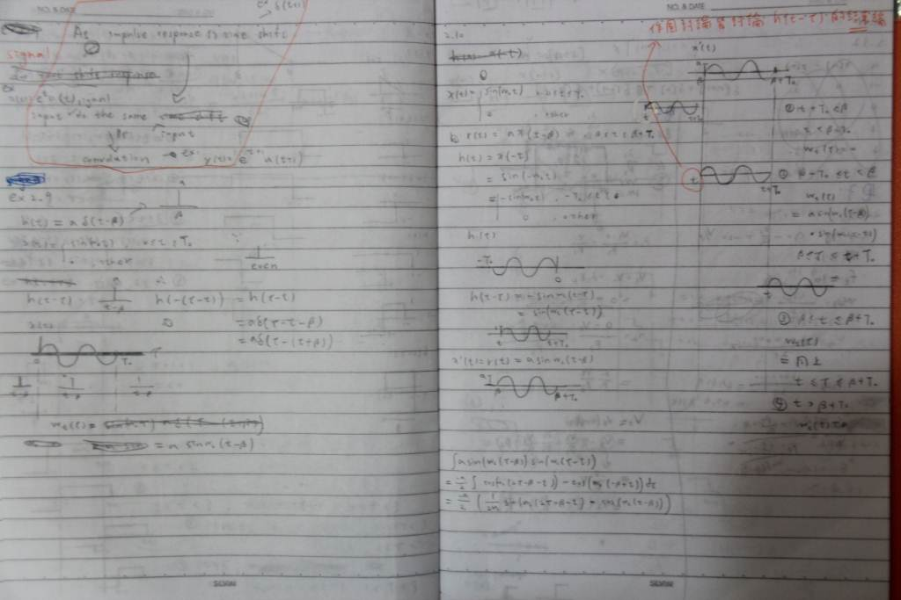
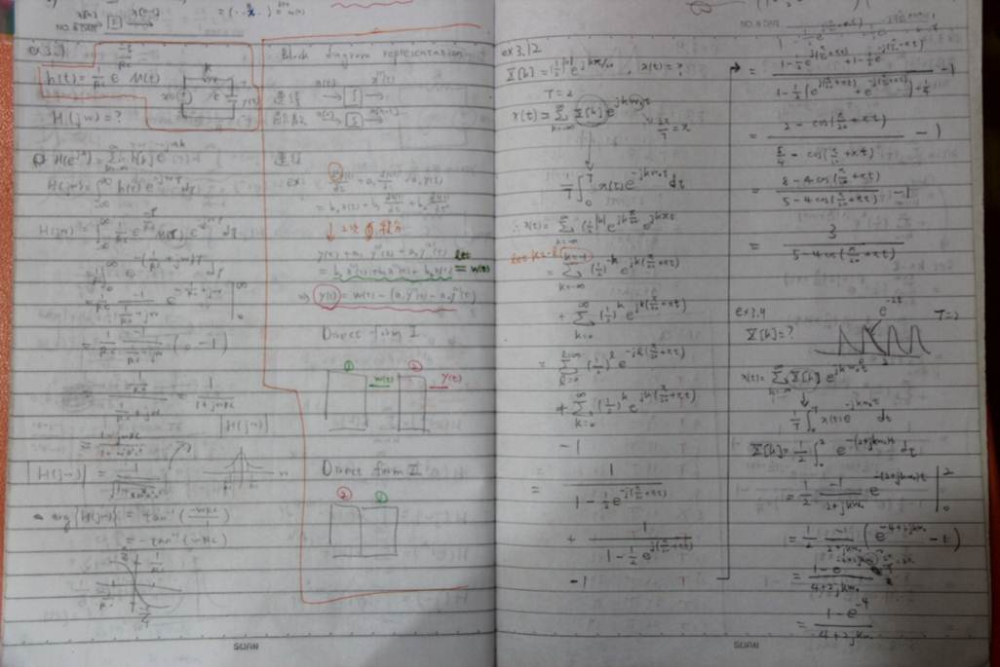
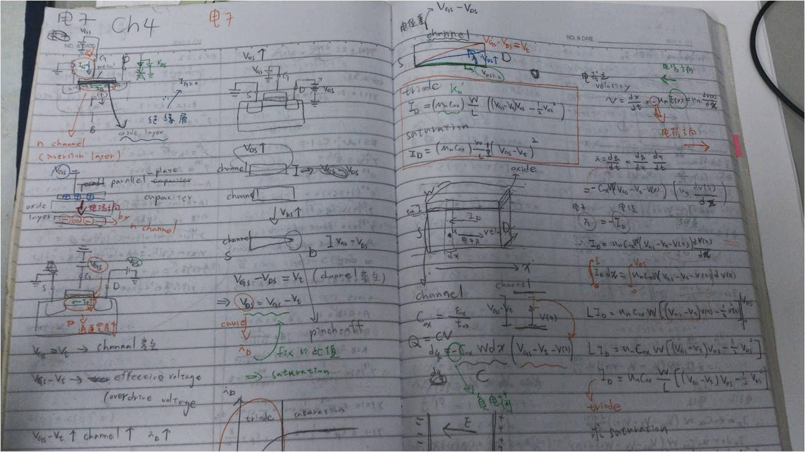
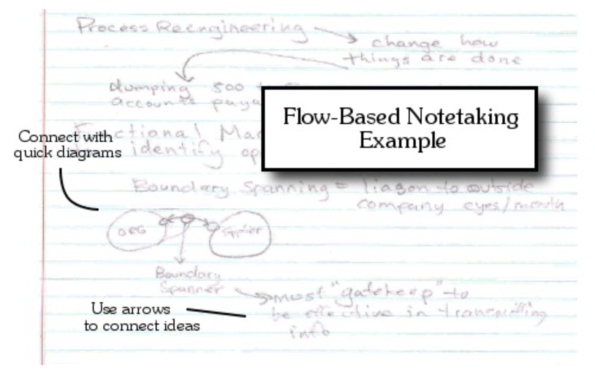
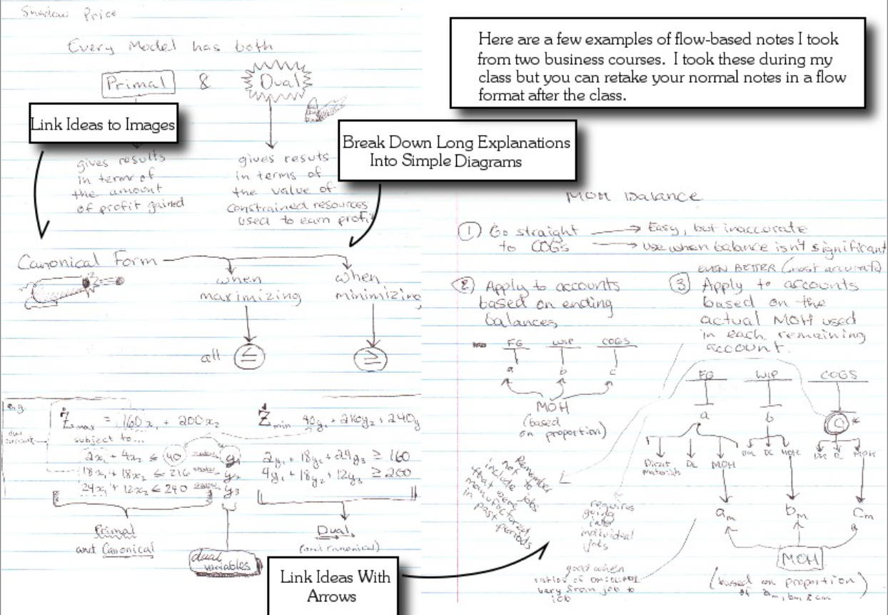

# 大學時我讀書的方法

往事不堪回首，但偶爾看一看也頗懷念的，其實就幾個要點

讀一個專業科目時

### 1. 學習資源
- 同時讀三本書
  - 原文書
  - 學長姊留下來的共筆
  - 我自己上課抄的筆記

> 盡量讀原文書，別讀中譯本，中譯本很多那翻譯的文字敘述都很奇怪

### 2. 時間規劃的方法
- 一天**專注**讀書兩小時
- 讀一門專業科目，手邊放一兩本課外書、一支便宜的塑膠手錶
- 看好現在幾點，30分鐘後一定休息
  - 休息片刻看課外書、看地下閱覽室的妹顧眼睛

> 第一點是高中時補陳建宏化學時，陳建宏的徒弟分享的經驗，感謝他

### 3. 做筆記的方式

- 從讀書變成"寫"書，原文書看不懂沒關係，我自己推導
- 善用筆記本，記錄你的思路與學習歷程
- 筆記方式：數學式、圖、盡可能少的文字
- 一本書讀不懂，不是你太笨，而是這本書寫不好，換一本書讀吧

> 第四個觀念，是當年高中時補聯立物理時所得到的，感謝聯立老師

> 以上方法摘錄自我第一年帶TA教訊號時，[分享給學弟妹的經驗談](http://dawarmwisdom.blogspot.tw/search/label/%E5%A6%82%E4%BD%95%E6%80%9D%E8%80%83%E8%88%87%E8%A8%8A%E8%99%9FTA)

## 大學時的筆記：訊號與系統

第一次教我同班同學時，所用的筆記

原文書上block diagram的敘述我看不懂，於是我自己在筆記本上從頭到尾自己推導

## 大學時的筆記：電子學

我記得我以前讀Smith的電子學時，剛開始讀時也是讀不懂，就算每一句英翻中看得懂，但是也抓不太到重點，後來我做了一件事，**自己寫**。

如上面的照片，**我讀到什麼，我就寫什麼**，既然我的記憶力不好，無法記住它，那我就把它寫下來，既然在閱讀英文上有障礙，課文的邏輯陳述我無法理解，那麼**我就在筆記本上，邊寫邊猜邊思考，然後用自己的邏輯與思考習慣，用詮釋課本的內容**，我是這樣子，才真正開始學習看英文與進行數學思考。

在照片中可看到，**都是圖，配上短短幾行數學式**，這些圖並非上課筆記，而是我看原文書時，從原文書的英文，邊讀邊思考邊寫，所轉化出來的。

人大多是視覺的動物，圖片往往一目瞭然，淺顯易懂，這是文字所比不上的。

原文書讀不懂，往往是因為你尚未有能力，把片段的英文句子組織起來，成為你能理解的邏輯。書讀不懂沒關係，書本的說法無法讓你理解也沒關係，你可以用自己的思考邏輯來教會自己，這本書讀不懂，不是你笨，也許是這本書寫不好，也許是這本書本來就不是寫給初學者看的，換一本就好了，就像電子學我比較喜歡Smith寫的，看不太懂Neamen寫的那本。

> 以上摘錄自我第二年教訊號時，[寫給學弟妹的一封信](http://dawarmwisdom.blogspot.tw/2014/06/102.html)

## 碩班時教通訊所的同學、學長姊、學弟妹

那時經驗也滿有趣的，碩一時幾乎沒有人聽得懂開課的老師在說什麼，我也聽不懂。

然後我就跑去問我碩班畢業時的指導教授，請他推薦一本原文書給我，老師他推薦了他當年出國讀博班時讀的書，我在圖書館裡找到它，上面陳年的灰塵與霉味，我啃了一兩週，寫了一整套筆記與教材，教了碩一同學、碩二碩三學長姊。

然後隔年又教了一次碩一的學弟妹。

> 請見[教同學的筆記與TA教材截圖](https://photos.google.com/share/AF1QipND8CBIsvJBBStPcvNFcO6LzsoGKJBH2tpo0mOI8Uc2nZvAJboOSDyy783BqkiGEQ?key=SnJLNzJkMGdFTHNxODNYSzRKZ1VRa3JWVmdQSW1R)

> 題外話，其中一張拍了好幾本筆記本的照片，那是我寫了六本筆記本，然後編出給大學部學弟妹的TA講義

> 題外話，為何說是我碩班畢業時的指導教授，因為我換過教授，碩班讀三年

# 為何要很隨性的讓字很醜、筆跡很亂

我記得我大學以前的筆記，字都超小超工整，等到大學時，我用了上面提到的方式學習，我的筆跡越來越亂。

最近翻到這本[自由書寫術](http://www.books.com.tw/products/0010726388)才知道背後的原理。

以下摘錄自「自由書寫術」的**抽離的價值**這一節

>當一天快結束時，我會請學員到外面連續書寫30分鐘

>不騙你，每個人聽到我這樣的要求，都像觸電了一樣

>我不會看他們書寫的內容，儘管如此，我總是能察覺到他們靈光乍現的那一刻，當我走過某人的身邊時，我會指著紙張的某處說「你從這裡開始討論重要的事」或是「你從這裡開始文思泉湧」

>我幾乎每次都說對，學員都很想知道，我是怎麼知道的

>我的秘訣很簡單：當他們開始書寫時，總是一板一眼地寫著，而且每個字都寫在隔線上，非常整齊。但是，一旦他們放鬆下來，內在的編輯開始鬆手，漸漸書寫出發自內心的思緒時，他們的動作就會放鬆下來。

>這樣情況是在瞬間發生的，而且很容易察覺到，即使他們面對著我，我只能倒著看他們的書寫內容，他們寫出來的字墨色變淺了，因為他們不再那麼用力寫字。

>這不僅是手的放鬆，也是腦的放鬆。就在這一刻，他們不再擔心自己寫的東西正不正確，或是語氣是否有禮，他們此時正運用另一部分的腦，挖掘出粗糙原始且有創造力的思緒

>後來我調查了一下我的學員，是什麼讓他們靈光乍現

>一些人說「靈感是在他們探索某種思緒時浮現，他們當時正在輸血一些對自己很有意義的主題，當他們探索過所有觀點過後，便進入忘我的狀態，被書寫帶著走。」

>另一些人說「注意力是否疲乏並不是原因，他們也沒有追隨某個思緒。事實上，他們做的事恰好與追隨某個思緒相反。當他們放棄原有的思緒，轉而跟隨一個更真實的新思緒時，靈感就自然浮現了。」

>Pat Schneider曾寫道「抽離與連結同樣重要。一個畫面會觸發下一個畫面。這就好像一個人想要利用溪水裡的五塊大石頭，跨越湍急的溪流，唯有踏上第一塊石頭，然後拋棄它，再踏上第二塊石頭，以此類推，最後才能踏上第五塊石頭，然後躍到河對岸。」

>因此，不要留戀沒有用的思緒，這一點很重要，不要認為你已經花了許多時間和精力思考某個解決問題的方法，所以你必須緊抓著它不放。一個思緒會引發另一個思緒，這是連鎖效應。以發射火箭為例，有些思緒就像是火箭的某一節，當它帶你進入高空後，就必須脫落，唯有如此，你才能順利進入外太空。因此，每個思緒都對你有幫助，但也同樣可以捨棄。

把這段文字與learning how to learn中提到的大腦的「發散模式」做連結，就很清楚為何要讓自潦草、筆跡亂。

腦在放鬆才有辦法迸發靈感，也難怪我總是能夠原文書沒看懂，就自行推導出書中的理論架構。

# 現在才知道我時間規劃的方法是什麼

番茄時鐘法，請見[Learning how to learn 初學筆記](./Learning how to learn初學筆記.md)

# 現在才知道我用的筆記方法是什麼

後來發現[如何高效學習](http://www.books.com.tw/products/CN11076666)這本書的作者，也用了與我相同的筆記方式，他稱之為

**flow-based note**

>以上圖片出自[Preview of Learn More, Study Less - Scott H Young](https://www.scotthyoung.com/learnmorestudyless/preview.pdf)
