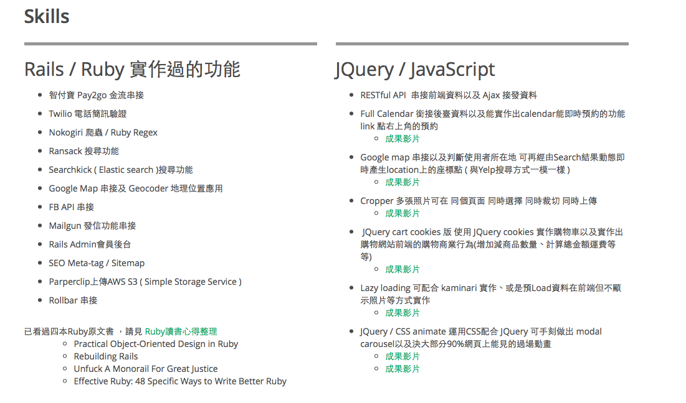
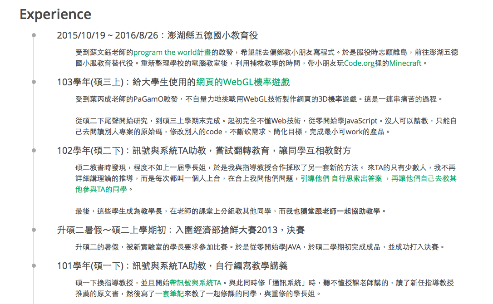
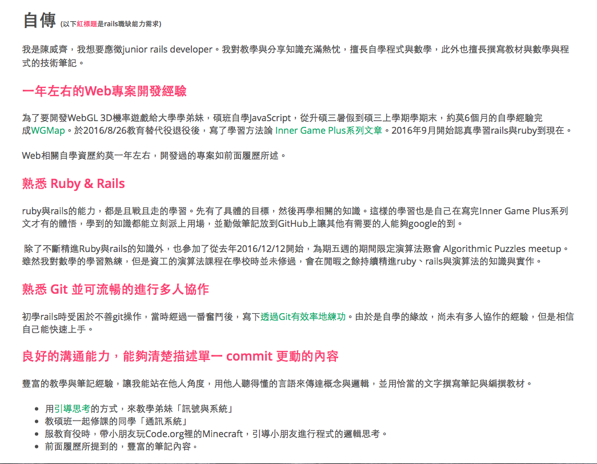
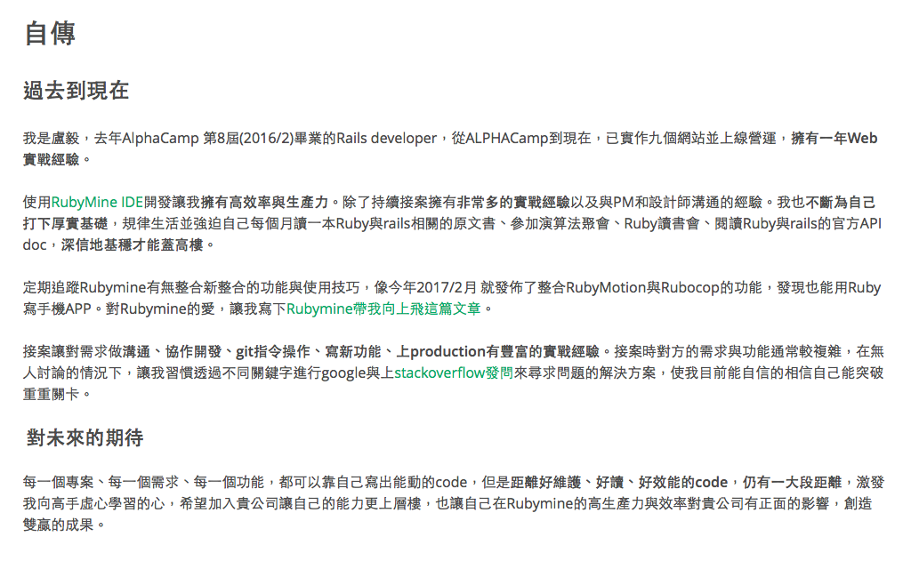

# 撰寫履歷：如何把自己賣一個好價錢

這篇文章其實是在講，我如何打造客戶的履歷，**讓他一天收到五家面試**。

這篇文章不講履歷排版，如果你像我當初一樣懶的話，可以考慮用[CakeResume](https://www.cakeresume.com/)這家新創的服務。

畫面非常的精美，下面舉例的截圖，也都是這服務的畫面，一天收到五份面試通知的履歷，就是用[CakeResume](https://www.cakeresume.com/)做的。

這篇文章的案例，我會以在我的臉書上獲得廣大迴響的[第一版履歷](https://www.cakeresume.com/be0d7e-icook)與[一天收五家面試的履歷](https://www.cakeresume.com/luyi_cv-22)來做說明。

# 讓你有動機看這篇文章

被我修改過的履歷，目前看來成果都不錯。

## case.1

第一位正式找我改履歷的人，當事人同意放上[我跟她協作時的hackMD](https://hackmd.io/s/BkPhmNQDe)，這份履歷優秀到她應徵公司的老闆寫一篇部落格專文讚賞
- [文武雙全很好啊！ - 鄉下老師 - udn部落格](http://blog.udn.com/yccsonar/90567422)

## case.2

第二位被我改履歷的是我朋友，他跟我同時間去投[2017五倍紅寶石的實習生](https://5xruby.tw/posts/interns-201701)，結果我2/2當天投當天通知面試，他投了卻石沈大海。

他的能力很強，但他這時也體會到「擁有優秀的能力，必須要讓人家看到才行」，於是我接手他的履歷。

經當事人同意，以下依先後順序放上他的履歷版本

1. [接手之前的版本](https://www.cakeresume.com/04d467)
2. 接手後，[我完成的版本](https://www.cakeresume.com/5x-ruby)
3. 他稍做修改後，[其他家公司大量投遞的版本](https://www.cakeresume.com/luyi_cv-22)

另外，一樣放上[跟他協作履歷時使用的hackMD](https://hackmd.io/s/Bka61Tx_x)

我接手的版本完成後，2/8他寄出履歷。我經手前的版本，也在2/8這天收到五倍紅寶石實習生感謝函，然後幾分鐘後又被五倍紅寶石打電話通知面試。**2/8當天晚上睡覺之前，他已經收到五家面試通知**。

當天我跟他聊天時這段我曾跟他說的話，他又對我提了一次「我以前跟他說的話」。

# 為何要把賺錢的秘密寫出來

**找我改履歷是要收錢的**，改履歷這種獵人頭公司的產業，一個case是**對方應徵上的工作一個月薪水**。

至於為何這麼貴，不要問我，這是行情價。行情真的是件很奇怪的東西。

對我來說，改履歷的能力，是誤打誤撞的，不在人生規劃裡。

但是我也不希望有太多人找我，影響到我學習與寫程式的正職工作。

我只希望一個月最多3個人找我改履歷就好了，所以**我會照行情收費，一個case就是應徵工作的一個月薪水**。用這方式來砍掉大量的人數，只留下**有誠意請我幫忙的人**。

將心比心，請不要找我砍價，我自己也不希望寫程式的行情被破壞，完全不打算破壞這產業的行情。

**這篇文章，會毫不保留地教你如何撰寫履歷。**

不藏私的原因也很單純，我下面要講的都不是新東西，可能都是你在某些文章或書本上看到過，但是我會輔以**文字、案例，與我自己思考的哲學**，來指導你用什麼方式看待你自己的履歷，以及如何修改它。

心法都一樣，駕馭文字的功力差距僅在於**時間與積累**，如果不想花十年的時間練，花錢買十年時間的功力就變成划算的選擇。

# 對履歷的看法

開始談每一個主題之前，我想先說一下我對履歷的看法。

對我來說，求職者就是一個要拿來賣的商品，履歷是商品的包裝，是商品的廣告，是商品的推薦文。

你，是這世界最重要的人，因為 **只有你會發自內心去把「你」這獨一無二的商品，打造到完美**。

所以我不喜歡104、1111這種制式履歷的求職平台，**這種服務讓人看不到你的獨特性**。

競爭是最爛的手段，**優秀的產品必定是獨一無二的，是壟斷的**。

身為一個求職者，**你的身份其實跟創業家是一樣的**，你必須創造一個產品，它獨特到能吸引特定的族群願意為你買單。

用盡你所有想得到的方法與手段，在有限的時間，有限的資源，去打造「你」這個商品，以此來吸引你的客群。

借用David Cummings對創業這議題，[他的看法](https://ruanyf.github.io/survivor/startup/50-things.html)其中一句話

>建立一個針對性很強的品牌，然後圍繞它把各方面都做好。

# 履歷的目的

履歷最重要的是，讓雇主「看到你的價值」。展現你的價值最有效的工具就是「事實」。

資深工程師往往都會建議年輕的工程師要寫部落格。[知名的工程師黃敬群先生](http://wiki.csie.ncku.edu.tw/User/jserv)也不斷地提到要勤寫wiki，把專案push到GitHub上讓大家知道你的實力，甚至進一步對世界級專案提出貢獻。

這都是同樣的道理，透過你做過的專案、做專案所得到的數據，是你最好的武器。**讓事實說話，讓數據說話**，這是最有說服力的。

>註解：這篇文章不只是給工程師看，也是給非工程師的族群看
>
>黃敬群先生，別名Jserv。他也是Android作業系統的貢獻者之一，全球近10億臺Android裝置上，都有他寫的程式碼。

## 實例

聽進我的話受益最大的就是上面的 **case.2** 這位顧客，他原本的部落格是非常簡單，只有他自己才看得懂的摘要。聽了我說的話，連續幾天瘋狂生部落格文章充實於他的[GitHub](https://github.com/lustan3216/BlogArticle/wiki)與[Medium](https://medium.com/@et3216)。

像是他的[Behavior-Bind-Media](https://github.com/lustan3216/Behavior-Bind-Media)專案，原本是他自己寫來為了提高接案生產力所寫的library。經過我詢問這library的細節後，**發現對於行銷我的顧客有非常大的價值**，於是，我逼著他[在這專案的README寫清楚這library的每一個細節](https://github.com/lustan3216/Behavior-Bind-Media#這個library怎麼誕生的)，並幫他潤飾文字，透過恰當的文字傳遞他的想法。

他的部落格用字遣詞也被我修了幾篇，之後的文筆就越來越好了，請見[幫別人改履歷2 - hackMD](https://hackmd.io/s/Bka61Tx_x)這兩章的內容
- **3D效果 - done**
- **Ruby與Rails讀過的書 - done**

# 履歷的大綱

履歷撰寫順序：

1. 自我介紹
2. skills / competence
3. 讓事實說話  (開發過的專案 / 具體展現你價值的時刻)
4. 經歷 (工作經歷 / 能為你增值的歷練)
5. 自傳

# 自我介紹

自我介紹很重要，是一份履歷的摘要、門面，是整份履歷要如何發想的骨幹。我會摘錄[自我介紹的技術](http://www.books.com.tw/products/0010736581)裡的兩招與 **我自己的方法**，並且輔以[case.2 - 我完成的版本](https://www.cakeresume.com/5x-ruby)當作說明。

## 我的方法：量身訂做求職者的個人形象

我經手過的履歷，都會用「量身訂做求職者的個人形象」做起手式，這形象是依照對當事人的了解，挖掘出求職者應徵的工作相符合的人格特質。

這麼做的考量，出自於上述我對履歷的看法：你要把自己打造成獨一無二的商品，**你是位針對性很強的商品**。

## 他山之石

以下這兩招我都是選擇性地用。

第一招：**用三句話統整的十八秒自我介紹**

>第一句話是先前提到「一句話自我介紹」的內容，也就是 **自己能提供的「未來」**。
>
>第二句話是說出能 **實現這未來的「證明」**。能提供未來的證明只得是實績，實績也就是 **「過去」**，換句話說，要談論自己的過去。
>
>第三句話是關於 **希望聽眾現在立即採取的行動**。由於是當下、立刻，所以講得是 **「現在」**。

第二招：**時間短具有極效性的「姓名解構」**

原書的技巧太過繁複，我謹摘錄開頭片段來說明這方法為何重要。有興趣你可以去看書，待會可看到具體實作解析。

>自我介紹中一定要提到的就是自己的名字。
>
>Dale Carnegie說過：「世界上最悅耳的音樂就是自己名字所發出的聲響」，對自己的名字有一份執著而深刻的愛。
>
>自己的名字是一生中動手寫過最多次的字、最常見的字，也是最重要的聲音，呈現出最令人鍾愛的型態。而對自己名字擁有的印象，幾乎等於自己的印象。
>
>這個「姓名解構」是我從諮詢師小田真嘉先生身上學到的。據說小田先生在進行業務員研修時，受到姓名解構影響的業務員，都不斷創造出好的表現和成績。
>
>寫下名字、他人呼喊自己的名字、在自我介紹時說出自己的名字時，對於名字所抱持的印象都會不斷被強化，深深地刻印在心裡。

## 實例

接著，我摘錄[case.2 - 我完成的版本](https://www.cakeresume.com/5x-ruby)的自我介紹。網頁上的版本已經被更動過，在此我付上最原始的版本

>我是盧毅，三顧茅「廬」於創業，恆心「毅」力於創業。終極目標是成為一位成功的創業家。大學畢業前後投過兩次錢創業失敗，輾轉做過不同工作，甚至做過工地主任擁有工地主任執照。創業家的人格特質，讓我專注於最短時間產生最大的生產力，熟練使用RubyMine來提升coding與debug的效率，總是不斷學習與研究更佳的方案、策略與實踐方法。

接著開始解析：

### 1. 我的方法

我希望讓HR對我的顧客產生「高生產力、高效率」的印象。我不斷跟他聊天，不斷探討他的本質。後來發現我們可以用「兩次創業的經歷」來打造他的人格特質，於是我用了與他身份相符合的「創業家」來塑造他的形象。

>我是盧毅，三顧茅「廬」於創業，恆心「毅」力於創業。終極目標是成為一位成功的創業家。

### 2. 十八秒自我介紹

十八秒自我介紹中，我特別鍾情於步驟2「展現你的過去，讓事實說話」。我把創業家的人格特質，結合了當事人兩次創業的經歷，以及熟練各種工具追求最大效率的過程，用洗鍊簡短的文字描述出來。

>大學畢業前後投過兩次錢創業失敗，輾轉做過不同工作，甚至做過工地主任擁有工地主任執照。創業家的人格特質，讓我專注於最短時間產生最大的生產力，熟練使用RubyMine來提升coding與debug的效率，總是不斷學習與研究更佳的方案、策略與實踐方法。

### 3. 姓名解構

很可惜我的顧客第三版並沒採用這方案，這方案我非常喜歡，也讓人印象深刻，直接看這段文字。

>我是盧毅，三顧茅「廬」於創業，恆心「毅」力於創業。

一段簡短的話語，看完後你要忘記我顧客的名字應該非常難，哪怕你根本還沒開始了解他。

這段子是純粹直覺的產物，它賦予了我顧客的名字非常具體的畫面，是普通人知道方法，也難以實踐的。**這是你難以獨自完成的事，這是我的服務能提供的價值**。

# skills / competence

我經手的履歷有個特點：**多寫list**。這麼做的目的，是要讓對方在最短的時間內了解你。

## 實例

以我[第一版的履歷](https://www.cakeresume.com/be0d7e-icook)為例子，以下摘錄自 **Skills** 這章

>自學Web，專案用過的技術
>- 客製化表單
>- 用scope把會常用到的SQL包成可串接的methods，來做資料篩選
>- AJAX上傳圖片
>- 串第三方API：Facebook登入
>...

每一次，我都會要我的客戶，把他原本情感豐沛的抒情文重寫，**把你的能力用條列式的list寫出來**。

人資HR通常會看不只一份履歷，而是很多履歷，**你該幫助HR快速瞭解你自己**，而不是讓HR只想把這履歷跳過不看。

# 讓事實說話

事實勝於雄辯。展現你的價值最有效的工具就是「事實」，能力越具體越好。

## 實例：工程師職業

請看[case.2 - 我完成的版本](https://www.cakeresume.com/5x-ruby)的 **Skills** 這章。

左邊 **Rails / Ruby 實作過的功能** 這節可以看到，我要求我的客戶把所有他寫過的Ruby/rails **技能都用條列式寫出來**，讓HR對他的能力一目了然。

右邊 **JQuery / JavaScript** 這節可以看到，由於接案不能公開程式碼，**我要求他把網站上寫過的功能用桌面錄影，讓他寫過的功能可以被看見**。

**你的歷練要具體呈現**。你要細心引導HR，讓HR看見你想讓他看見的東西，**你耀眼的價值**。

## 非工程師職業

非工程師職業的，如果你的職業有**數字、數據證據**。那恭喜你，你完全可以照「工程師職業」的方式去寫履歷，讓數字與事實為你說話。

>例如：前一份工作，自從你加入後業績增加20%，這就是很具體的成果。

如果你的職業沒有數據輔助來證明你的能力，去回想你每份工作，工作中最困難最讓你印象深刻的事情是什麼，從這點去發想出一個「故事」，這是個勾人的故事，讓對方從這故事看出你的能力。

我必須坦承這邊對於非工程師的職業沒那麼好處理，但這就是我的價值了。

與我合作，**我會透過問題與聊天去引導你說出你的歷練**。從中我會知道哪些是可以用的素材，哪些是有潛力但是你忽略甚至根本不知道怎麼用的素材，**這是你難以獨自完成的事，這是我的服務能提供的價值**。

很抱歉這邊無法給予非工程師的實例，因為對方是尚未開始的案子，結案後也許是後會補上。

# 經歷

經歷的呈現，必須呼應你的自我介紹。以我的[第一版的履歷](https://www.cakeresume.com/be0d7e-icook)為例子。

我在自我介紹中寫

>我是陳威齊，我的天職是老師，對分享知識與技術充滿熱忱。我擅長教學與編撰容易理解的學習筆記。能依據不同目標需求撰寫文案、文章、製作投影片。為了打造我心目中理想的數學學習系統，選擇成為一名Web工程師來學習我需要的技能與知識。

於是，你再去看Experience這節。可以看到，我呈現出自己的經歷，都是跟教育、跨領域自學的能力、幫助他人有關的經歷。

你必須讓你的經歷，跟你為自己打造的形象具有一致性，**不要寫對你想呈現的形象無關聯的經歷**。

# 自傳

自傳是畫龍點睛之處。每個人都需要典範，你求職的工作他的能力需求，也需要個典範。

## 能力需求的典範

首先，你該從職缺海中，找出工作能力需求的典範，我當初是用[Rails 工程師 | 愛料理情報室](https://newsroom.icook.tw/jobs/rails-developer)，現在讓我們看一下iCook的rails developer開缺所要的能力要求

>所需條件
>- 一年以上 Web 專案開發經驗
>- 熟悉 Ruby & Rails
>- 熟悉 Git 並可流暢的進行多人協作
>- 良好的溝通能力，能夠清楚描述單一 commit 更動的內容
>- 能夠迅速釐清問題，用有效的關鍵字搜尋解決方案
>- 能夠透過英文吸收新知
>
>加分條件
>- 熟悉 SQL 及常見資料分析應用
>- 銜接過國內外任何金流服務
>- 曾經完成任何程式相關的 MOOC 課程
>- 曾經貢獻過 Open Source 專案
>- 定期追蹤最新軟體開發相關消息

在此iCook所開出的能力需求，就是我的典範，**典範讓我量身訂做對方希望的能力**。

現在，我依此向你分享兩種寫法

## 方法.1

以我的[第一版的履歷](https://www.cakeresume.com/be0d7e-icook)的 **自傳** 這章為例子。

請見我的自傳，自傳那邊有紅標題，然後裡面是說明為何我與這能力相符合。

你可以看到，我並不是iCook開出的能力需求全部都寫，**我只有陳述事實，寫上我覺得自己匹配的能力**。

## 方法.2

以[case.2 - 我完成的版本](https://www.cakeresume.com/5x-ruby)的 **自傳** 這章為例子。我採用簡短洗練的文字，用短文的方式呈現這位顧客的價值。

這邊你看到了成品，你也可以看看，我與顧客是如何合力產出這段畫龍點睛的自傳，請見[幫別人改履歷2 - hackMD](https://hackmd.io/s/Bka61Tx_x)，其中的「自傳」這章，你可以看到我為他修改的足跡與紀錄。

**這是你難以獨自完成的事，這是我的服務能提供的價值**。

# 結語

以上就是我自己的心法，如果看完你依舊想請我協助你改履歷，可以寫信聯絡我

信箱：<dawarmwisdom@gmail.com>
