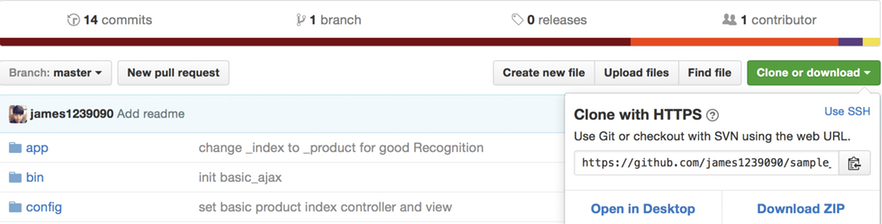
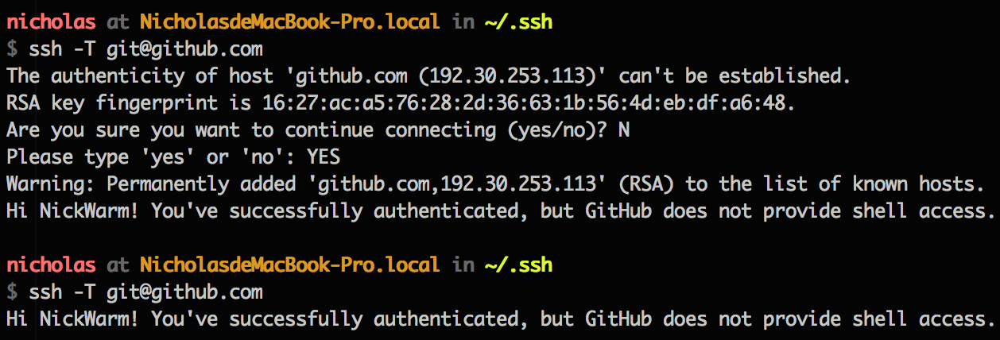

# 透過Git有效率地練功

遇到Git相關的問題，推薦查閱[Git | GitBook](https://zlargon.gitbooks.io/git-tutorial/content/index.html)這本電子書。個人建議遇到問題時再去查書，不要從第一頁看到最後一頁，這樣你學不會，看完也忘光光。

## 臨摹寫code

有效率地透過git來練習寫code。

這篇教學以臨摹TreeHouse的教材為例。[我推薦用TreeHouse入門Web](./為何我推薦TreeHouse而非CodeSchool.md)，TreeHouse都會提供課程的code，會有**start**與**final**，copy一份**start**後，改個專案名字。

把專案初始化
```
git init
```

>如果要自己架Git Server跟別人協同開發，[JC大建議](http://tienshunlo-blog.logdown.com/posts/711614-novice-instruction-day2-hd)初始化寫  ( 新手不需要用這方法 )，詳情請見[Git - 架設伺服器](https://git-scm.com/book/zh-tw/v1/%E4%BC%BA%E6%9C%8D%E5%99%A8%E4%B8%8A%E7%9A%84-Git-%E6%9E%B6%E8%A8%AD%E4%BC%BA%E6%9C%8D%E5%99%A8)。

```
git init --bare project.git
```

接著照著課程打code

每段影片都會有數個步驟，第一次寫時，我會每一個小步驟都
```
git add .
git commit -a -m "....."   /*不進入vim的寫法
```

>這是[sdlong對git commit的看法](http://sdlong.logdown.com/posts/736307)，我會在[臨摹他人的帖子如何做筆記](./臨摹他人的帖子如何做筆記.md)這篇文章中解釋，實作sdlong的學習法後，為何我不再使用「每一個小步驟都`git commit`送出一個patch」，他背後的理由與修正後的筆記方法。

上面這行可以簡寫做
```
git commit -am "....."
```

若是對commit的內容不滿意，可以透過下面這指令來修改最新的commit
```
git commit --amend
```

下完 `--amend`指令後，會進入vim編輯器

一開始我們是無法進行編輯的，入要編輯要按下
```
i
```

接著，把commit修改成我們希望的內容，完成編輯後，我要要退出編輯，按下
```
esc
```

最後，我們要儲存並離開，按下
```
:wq
```

如果不想進到vim去改也可以透過
```
git commit --amend -m "message"
```

若是我們對現在的進度不滿意，想要回到以前的紀錄(4)，首先我們要看過去的紀錄
```
git log
```

下完指令後，我們可以看到過去個版本的標記代碼，如果你只想看到**最新的三筆資料**，可以下
```
git log -3
```
以此類推

下指令，回到過去的版本
```
git checkout <過去版本代碼>
```

現在我們回到過去了，如果我們想回到最新版本，就下
```
git checkout <最新版本的代碼>
```

回到過去某一版，並把最新版的紀錄都消掉，就下
```
git reset --hard  <過去版本的代碼>
```

### 再練習一遍
照著教學，我們寫完一遍後，接著我想要再練習一遍

首先我用`git log`找到我想要練習的版本，並用`git checkout`跳回去，接著我再開一個新分支
```
git checkout -b (branchname)
```

然後我就能練到爽了

如果你同個練習已經開數個分支練太多遍了，想要把多餘的分支砍掉，可以下
```
git branch -d (branchname)
```

### merge

每**寫一個新功能就開一個branch**，然後再**merge**之。

一般來說，你要commit到production的branch都在master，現在你要開一個新branch，可以下
```
git checkout -b (寫新功能的branchname)
```

你就會跳到新branch，然後盡情地寫你要的功能，不用怕過去的進度被搞壞，當你寫好新功能後，跳回**master** branch
```
git checkout master
```

接著我們要把新寫好的功能加到master去
```
git merge (寫新功能的branchname)
```

功能加好後，你就能把新開的分支砍掉
```
git branch -d (branchname)
```

### 臨摹他人的GitHub projects
我們可以從他人的專案去學習，首先到他人專案的GitHub，點選 `Clone or download`



接著把這段網址複製下來，先用iTerm進入到你想要下載的路徑，然後下指令
```
git clone [ 複製下來的網址 ]
```
這樣就能把人家的專案與commit紀錄都複製下來了。

>個人建議用git clone來載他人的專案最恰當，如果你用Download Zip，雖然也可以把人家的專案載下來，但是這載下來的專案沒有任何Git commit，這對我們的學習是沒有幫助的。

## 上傳到GitHub

你寫好的專案可以上傳到GitHub，open source出來

在 Github 新增專案
* 按右上角的 `+`，選擇 **New repository**
* 輸入 **Repository name**
* 這裡先不要勾選 **"Initialize this repository with a README"**
* 按 **Create repository**

新增完成後，Github 會提供你 Repository 的 URL

### 設定環境，使他能上傳GitHub

接著我們下指令生成SSH Key
```
$ ssh-keygen -t rsa
```

下完指令後，會出現幾個問題，這裡只要一直按 enter 就行了

接著將公鑰`id_rsa.pub`上傳到 Github Server

點選`你的GitHub個人頁面 >  Settings > SSH Keys`

點右上角的`Add SSH key`

把 `~/.ssh/id_rsa.pub` 的內容複製貼上，點選 "Add key" 送出

測試 SSH，下指令
```
$ ssh -T git@github.com
```

初次連線 Github Server 可能會出現以下訊息，輸入 **yes** 即可
```
The authenticity of host 'github.com (207.97.227.239)' can't be established.
# RSA key fingerprint is 16:27:ac:a5:76:28:2d:36:63:1b:56:4d:eb:df:a6:48.
# Are you sure you want to continue connecting (yes/no)? yes
```



### 上傳到GitHub

這段落改編自[設定 Repo URL](https://zlargon.gitbooks.io/git-tutorial/content/remote/remote.html)、[上傳分支](https://zlargon.gitbooks.io/git-tutorial/content/remote/push.html)，是我習慣的流程。

一開始要先在你要上傳的專案底下，下這道指令
```
git remote add origin [你的 Repository 的 URL]
```
